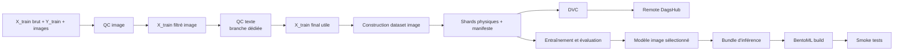

# Rakuten-DS — préparation et classification des images

Cette branche construit la partie image du pipeline de préparation des données
Rakuten et les modèles nécessaires à leur comparaison.

Le premier objectif n'est pas de déployer une plateforme MLOps complète. Il est
de produire des modules Python, des scripts de pipeline et les tâches Airflow
qui pourront être réutilisés plus tard dans l'architecture finale.

## Périmètre de la branche

La branche doit :

1. contrôler la qualité des images associées à `X_train` ;
2. produire une première version filtrée de `X_train` sans supprimer les
   données brutes ;
3. transmettre ce CSV au futur contrôle qualité du texte, développé sur une
   branche dédiée ;
4. construire, à partir du CSV final, un dataset image utilisable par PyTorch ;
5. sauvegarder physiquement cet artefact coûteux à produire ;
6. le versionner avec DVC et le sauvegarder sur le remote DagsHub ;
7. orchestrer ces étapes dans un DAG Airflow de type `raw_dataset_maker`,
   exécutable seul ou comme préambule optionnel à un entraînement ;
8. entraîner, évaluer et comparer les modèles image sur des versions identiques
   du dataset ;
9. conserver ResNet50 + XGBoost comme baseline de l'équipe et permettre la
   comparaison avec d'autres modèles image ;
10. produire un bundle d'inférence autonome ;
11. fournir les scripts nécessaires pour enregistrer le modèle, construire le
    BentoML et tester le service image.

La branche ne doit pas :

- introduire ZenML ;
- construire une image Docker/OCI du modèle ;
- ajouter un Dockerfile applicatif ;
- implémenter le déploiement, le Model Registry ou le monitoring de production ;
- coupler les modules à une plateforme d'orchestration particulière ;
- implémenter dès maintenant des composants Kubeflow Pipelines.

Le service d'inférence et son packaging BentoML font partie de cette feature.
Sa containerisation, son déploiement dans un cluster, son exposition réseau, sa
promotion et son monitoring appartiendront à l'architecture MLOps finale.

Le Compose minimal fourni sous `dev/local_stack` est uniquement un bac à sable
de développement pour exécuter Airflow, MLflow et MinIO. Il ne constitue pas
une image applicative ni une base pour l'infrastructure finale.

L'architecture MLOps cible utilisera Kubeflow. Les modules développés ici
devront donc avoir des entrées et sorties explicites afin d'être enveloppés plus
tard dans des composants Kubeflow, sans réécriture de leur logique métier.

## Flux de données cible



Le DAG `raw_dataset_maker` orchestre le flux de `A` à `I`. Il peut être :

- déclenché indépendamment pour publier une nouvelle version du dataset ;
- ignoré lorsqu'une version DVC valide existe déjà ;
- utilisé comme préambule d'un DAG d'entraînement ;
- arrêté après le QC image tant que le composant de QC texte n'est pas encore
  disponible.

## Données d'entrée

Le fichier de référence fourni, `X_train_update.csv`, contient :

- 84 916 lignes ;
- un index source non nommé ;
- `designation` ;
- `description` ;
- `productid` ;
- `imageid`.

Environ 29 800 descriptions sont vides. Cette information relève du futur QC
texte et ne doit pas entraîner d'exclusion dans le QC image.

Le label `prdtypecode` est fourni séparément dans `Y_train`. L'index source doit
donc être préservé pendant tous les filtres afin de garantir une jointure exacte
entre les données, les images et les labels.

## Contrat des filtres

Un filtre ne supprime jamais une image ou une ligne des données brutes. Il
produit deux artefacts :

1. un CSV compatible avec l'étape suivante, contenant le sous-ensemble retenu
   et les colonnes d'origine ;
2. un manifeste d'audit contenant une ligne pour chaque échantillon analysé.

### Identifiant stable

Chaque échantillon reçoit un `sample_id` déterministe construit à partir de :

- l'index source ;
- `productid` ;
- `imageid`.

Les étapes ne doivent jamais utiliser le numéro de ligne courant comme seul
identifiant après un filtrage ou une réindexation.

### Manifeste QC image

Le manifeste doit au minimum contenir :

- `sample_id` et `source_index` ;
- `productid`, `imageid` et `image_path` ;
- la présence et la lisibilité du fichier ;
- le checksum du fichier ;
- les dimensions, le format et le mode colorimétrique ;
- les scores de luminosité, contraste, netteté et quantité d'information ;
- les groupes de doublons et quasi-doublons ;
- les scores d'outlier et, lorsqu'ils existent, les scores Cleanlab ;
- `image_qc_status` ;
- `image_qc_reason_codes` ;
- `included_after_image_qc` ;
- les versions du code, de la configuration et des outils ;
- l'identifiant du run et la date de production.

Les statuts proposés sont :

- `PASS` : ligne conservée ;
- `WARNING` : ligne conservée mais signalée ;
- `FILTERED` : ligne absente du CSV filtré, mais toujours présente dans les
  données brutes et le manifeste ;
- `ERROR` : analyse incomplète ou incohérente, le pipeline doit échouer.

Le filtrage est donc entièrement réversible en changeant la configuration et en
rejouant le pipeline.

## Stratégie de contrôle qualité image

### 1. Contrôles déterministes

Ces contrôles constituent le socle bloquant :

- correspondance entre `source_index`, `productid`, `imageid` et le nom du
  fichier ;
- existence du fichier ;
- ouverture et décodage complet ;
- format autorisé ;
- dimensions non nulles ;
- checksum ;
- détection des doublons exacts ;
- détection des doublons traversant les futurs splits.

Ils seront implémentés avec des bibliothèques simples telles que Pillow/OpenCV
et ne dépendront pas d'un agent IA.

### 2. Qualité visuelle

[CleanVision](https://cleanvision.readthedocs.io/en/latest/) ou les contrôles
image de
[Cleanlab Datalab](https://docs.cleanlab.ai/stable/tutorials/datalab/image.html)
seront évalués pour détecter :

- images trop sombres ou surexposées ;
- images floues ;
- faible quantité d'information ;
- dimensions ou ratios atypiques ;
- images en niveaux de gris ;
- anomalies propres à la distribution du dataset.

Un spike devra permettre de retenir une seule implémentation principale afin
d'éviter deux dépendances qui calculent les mêmes métriques.

### 3. Doublons, similarité et outliers

[FiftyOne Brain](https://docs.voxel51.com/brain/index.html) sera évalué avec les
embeddings ResNet50 produits par le projet pour :

- trouver les quasi-doublons ;
- identifier les voisins visuels ;
- calculer l'unicité ;
- rechercher les outliers ;
- détecter les fuites potentielles entre splits.

[Fastdup](https://visual-layer.github.io/fastdup/) ne sera ajouté que s'il
apporte un avantage mesurable en précision, en temps ou en mémoire.

### 4. Cohérence image-label

La solution gagnante du challenge, décrite dans
[A Multimodal Late Fusion Model for E-Commerce Product Classification](https://arxiv.org/abs/2008.06179),
a utilisé des probabilités hors-échantillon produites en validation croisée,
puis Cleanlab pour classer les labels suspects.

Notre pipeline devra :

- produire une probabilité out-of-fold pour chaque image ;
- garantir que le modèle ayant produit la probabilité n'a pas vu l'image ;
- calculer les scores Cleanlab ;
- comparer plusieurs politiques de filtrage ;
- conserver les scores et motifs dans le manifeste.

Aucun pourcentage fixe ne sera codé en dur. La politique sera configurable et
évaluée sur les métriques du modèle ainsi que sur la distribution des classes.

## FiftyOne et agent qualité

FiftyOne pourra fonctionner sans interface graphique dans le DAG. Son SDK
Python permet de calculer les métriques, créer des vues, poser des tags et
exporter des sélections en mode headless.

Un agent qualité pourra utiliser le
[serveur MCP de FiftyOne](https://docs.voxel51.com/agents/using_agents.html) ou
des opérateurs dédiés pour :

- synthétiser les résultats d'un nouveau lot ;
- rapprocher une anomalie de ses voisins visuels ;
- prioriser les cas intéressants ;
- expliquer les motifs du filtre ;
- préparer ou appliquer une politique configurée au CSV de sortie.

Le niveau d'autonomie pourra évoluer, car aucune donnée brute n'est supprimée.
La contrainte essentielle est la traçabilité : toute décision automatique ou
humaine doit apparaître dans le manifeste et pouvoir être annulée en rejouant
le pipeline avec une autre configuration.

FiftyOne reste un index de travail et d'exploration. Le CSV filtré et le
manifeste versionnés constituent les sources de vérité du pipeline.

## Dataset image persistant

La construction et le prétraitement du dataset image sont coûteux. L'artefact
sera donc matérialisé sur disque, tracké par DVC et poussé sur DagsHub.

La branche contient déjà une première implémentation LMDB partitionnée dans
`rakuten_vision/dataset.py`. Elle constitue une base à auditer et refactorer.

### Format recommandé

Le terme « dataset PyTorch sauvegardé » désigne :

- des shards physiques, LMDB en première intention ;
- un manifeste décrivant les shards et les échantillons ;
- une classe `torch.utils.data.Dataset` légère qui lit ces shards.

Il ne faut pas sauvegarder directement avec `torch.save()` une instance complète
de `Dataset` contenant du code Python. Une telle sérialisation serait fragile
face aux changements de classes, de versions de PyTorch et de chemins.

Chaque record physique doit contenir au minimum :

- `sample_id` ;
- image RGB sous forme encodée ou tenseur `uint8` ;
- label `prdtypecode` ;
- métadonnées nécessaires à l'audit.

Le manifeste du dataset doit contenir :

- version du CSV final ;
- version de `Y_train` ;
- configuration de preprocessing ;
- liste, taille et checksum des shards ;
- nombre d'échantillons et distribution des classes ;
- mapping des labels ;
- statistiques de normalisation si elles sont calculées ;
- version du code de construction.

### Transformations

Les opérations déterministes et coûteuses peuvent être matérialisées :

- lecture et conversion RGB ;
- correction d'orientation ;
- redimensionnement déterministe éventuel ;
- validation du tenseur.

Les augmentations aléatoires ne doivent pas être figées dans LMDB. Rotation,
crop aléatoire, jitter de couleur et autres augmentations seront appliqués à la
lecture par le `Dataset` PyTorch afin de varier à chaque époque.

### Propriétés attendues

Le builder devra :

- être déterministe à configuration identique ;
- écrire les shards de manière atomique ;
- reprendre après interruption ;
- limiter la taille des shards ;
- conserver l'ordre via `sample_id`, sans dépendre de l'ordre physique ;
- vérifier chaque shard après écriture ;
- produire un petit échantillon de contrôle ;
- charger les données sans avoir besoin des CSV bruts ;
- fonctionner en CPU et permettre plusieurs workers de `DataLoader`.

## DVC et DagsHub

Le remote DVC `origin` est déjà configuré vers :

`https://dagshub.com/jeanbaptiste-billaud/Rakuten-DS.dvc`

DVC devra suivre :

- le CSV filtré après QC image ;
- le manifeste QC image ;
- le CSV final après QC texte ;
- le dataset image matérialisé ;
- son manifeste et ses rapports de validation.

Git ne contiendra que les fichiers `.dvc`, les configurations légères et le
code. Les shards et autres artefacts volumineux seront stockés sur DagsHub.

## DAG Airflow `raw_dataset_maker`

Le DAG doit orchestrer des scripts qui restent exécutables séparément.

### Tâches proposées

```text
validate_raw_inputs
        |
compute_image_metadata
        |
compute_image_quality
        |
compute_image_similarity
        |
compute_image_label_quality        # optionnel et plus coûteux
        |
build_image_qc_manifest
        |
filter_x_train_image
        |
run_or_load_text_qc                # ajouté lors de l'intégration de la branche texte
        |
build_final_x_train
        |
build_image_dataset
        |
validate_image_dataset
        |
dvc_track_dataset
        |
dvc_push_dagshub
        |
publish_dataset_manifest
        |
trigger_training                    # optionnel
```

### Paramètres du DAG

Le DAG devra notamment accepter :

- version ou chemin des données brutes ;
- configuration QC image ;
- activation du contrôle Cleanlab ;
- version attendue du filtre texte ;
- reconstruction forcée ou réutilisation du cache ;
- construction ou non du dataset physique ;
- push DVC ou exécution locale uniquement ;
- déclenchement ou non du pipeline d'entraînement.

Chaque tâche devra être idempotente, vérifier ses entrées et publier ses sorties
dans un emplacement versionné. Les tâches Airflow ne contiendront pas la logique
métier : elles appelleront les modules et scripts de cette branche.

## Architecture de code proposée

```text
src/
├── data_quality/
│   └── image/
│       ├── contracts.py
│       ├── file_checks.py
│       ├── visual_quality.py
│       ├── similarity.py
│       ├── label_quality.py
│       ├── manifest.py
│       └── filtering.py
├── datasets/
│   └── image/
│       ├── builder.py
│       ├── lmdb_dataset.py
│       ├── transforms.py
│       └── validation.py
├── models/
│   └── image/
│       ├── contracts.py
│       ├── resnet_embedder.py
│       ├── xgboost_classifier.py
│       ├── resnet_classifier.py
│       ├── training.py
│       ├── evaluation.py
│       └── serialization.py
├── model_serving/
│   └── image/
│       ├── build_step.py
│       ├── service.py
│       ├── bentofile.yaml
│       ├── bento_requirements.txt
│       └── model_building.sh
└── pipeline_steps_df/
    ├── data/
    │   ├── run_image_qc.py
    │   ├── filter_x_train_image.py
    │   ├── build_image_dataset.py
    │   └── validate_image_dataset.py
    ├── training/
    │   ├── train_image_model.py
    │   ├── evaluate_image_model.py
    │   └── compare_image_models.py
    └── build_image_bento.py

dags/
└── raw_dataset_maker.py

dev/
└── local_stack/
    ├── compose.yaml
    ├── README.md
    └── dags/
        └── local_stack_smoke_test.py

configs/
├── image_qc.yaml
├── image_dataset.yaml
├── train_image.yaml
└── image_serving.yaml
```

Les noms pourront être adaptés aux conventions générales du dépôt lors de
l'intégration, mais la séparation entre logique métier, scripts et
orchestration devra être conservée.

## Modèles de comparaison

### Baseline historique retrouvée

L'approche développée précédemment par l'équipe existe toujours :

- `dev:Images-model_comparison/app/preprocess.py` ;
- extraction ResNet50 avec `fc = nn.Identity()` ;
- embeddings de dimension 2048 ;
- classification avec `xgb.XGBClassifier` ;
- configuration historique dans `dev:configs/train_image.yaml` ;
- première version identifiable dans le commit `0ef2562`.

Ce code sera récupéré et décomposé en modules réutilisables.

### Comparaisons prévues

- ResNet50 figé + XGBoost ;
- ResNet50 avec tête de classification ;
- scripts ResNet existants `rakuten_train_distributed.py` et
  `train_k_fold.py` après audit ;
- backbone affiné inspiré de la solution gagnante, si le coût de calcul le
  permet ;
- comparaison sur dataset brut, filtré image, puis filtré image + texte.

Les mêmes splits, métriques et versions de données devront être utilisés pour
que la comparaison mesure réellement l'effet du modèle et du QC.

## Pipeline d'entraînement image

Les scripts d'entraînement feront partie de cette branche et devront pouvoir
être exécutés localement, depuis Airflow ou, plus tard, dans un composant
Kubeflow.

Le pipeline devra :

1. résoudre explicitement la version DVC du dataset ;
2. charger les splits et vérifier leur manifeste ;
3. entraîner le modèle demandé depuis une configuration ;
4. sauvegarder les checkpoints et l'état nécessaire à une reprise ;
5. évaluer le modèle avec les mêmes métriques et splits que les autres
   candidats ;
6. produire un bundle autonome pour l'inférence ;
7. publier un rapport de comparaison machine-readable ;
8. retourner un code de sortie clair sans dépendre d'un objet Airflow.

Le bundle d'inférence devra contenir, selon le type de modèle :

- les poids et l'architecture du backbone ;
- le classifieur XGBoost ou la tête neuronale ;
- les transformations déterministes ;
- la version des poids ResNet ;
- le mapping des labels ;
- les classes dans l'ordre des probabilités ;
- la configuration utile à l'inférence ;
- les versions du code et du dataset ;
- les métriques de validation ;
- un fichier de métadonnées et des checksums.

Pour ResNet50 + XGBoost, l'extracteur et le classifieur forment un seul modèle
logique. Ils ne devront jamais être promus ou packagés séparément.

## Packaging du modèle avec BentoML

Les branches `main` et `dev` contiennent déjà une chaîne BentoML pour le modèle
texte :

- `src/model_serving/build_step.py` ;
- `src/model_serving/service.py` ;
- `src/model_serving/bentofile.yaml` ;
- `src/model_serving/model_building.sh`.

Cette structure sera reprise, mais la logique texte ne sera pas copiée dans le
service image. Le builder image acceptera en entrée un bundle d'inférence
explicite. Un adaptateur à MLflow pourra être ajouté pour l'architecture finale,
mais le build local ne devra pas exiger un serveur MLflow.

### Contrat du service image

Le service BentoML devra :

- accepter une image ou un lot d'images sous un format documenté ;
- valider taille, type MIME, décodage et limites de requête ;
- appliquer exactement le preprocessing versionné avec le modèle ;
- exécuter ResNet50 + XGBoost ou le modèle image sélectionné derrière une
  interface commune ;
- retourner `prdtypecode`, libellé de catégorie, top-k, probabilités ou scores,
  confiance et avertissements QC utiles ;
- exposer les versions du modèle, du dataset, du preprocessing et du bundle ;
- traiter proprement les images invalides sans faire tomber le batch entier ;
- fonctionner sans accès aux données d'entraînement ;
- charger tous ses artefacts depuis le Bento construit.

### Scripts de build

Les scripts devront séparer :

1. validation du bundle ;
2. enregistrement des artefacts dans le model store BentoML ;
3. génération du `bentofile.yaml` ou de ses paramètres ;
4. `bentoml build` ;
5. smoke tests du Bento local ;
6. production d'un manifeste contenant tags, checksums et provenance.

Le build devra être reproductible, non interactif et échouer si un artefact
requis ou une information de provenance manque. La containerisation, le
déploiement ou le redémarrage d'un service en production ne feront pas partie
de ces scripts.

## Roadmap

### Phase 0 — Contrats et baseline

- [ ] Ajouter `X_train_update.csv` comme source DVC ou documenter sa source
  canonique.
- [ ] Formaliser `sample_id`, les schémas des CSV et le manifeste QC.
- [ ] Vérifier la jointure exacte avec `Y_train`.
- [ ] Définir les reason codes et la politique de filtrage configurable.
- [ ] Mesurer un baseline modèle avant filtrage.

### Phase 1 — QC image déterministe

- [ ] Implémenter les contrôles de fichiers et de correspondance.
- [ ] Extraire les métadonnées image.
- [ ] Détecter les corruptions et doublons exacts.
- [ ] Produire un premier manifeste complet.
- [ ] Ajouter tests unitaires et échantillons invalides synthétiques.

### Phase 2 — Qualité visuelle et similarité

- [ ] Comparer CleanVision et Cleanlab Datalab.
- [ ] Intégrer l'outil retenu.
- [ ] Calculer ou réutiliser les embeddings ResNet50.
- [ ] Intégrer les analyses FiftyOne Brain.
- [ ] Évaluer Fastdup seulement si nécessaire.
- [ ] Détecter les groupes qui ne doivent pas traverser les splits.

### Phase 3 — Qualité des labels

- [ ] Produire des prédictions out-of-fold.
- [ ] Intégrer Cleanlab.
- [ ] Enregistrer scores, prédictions et motifs dans le manifeste.
- [ ] Évaluer plusieurs seuils sans supprimer les données brutes.
- [ ] Mesurer l'effet du filtre par classe et sur les métriques.

### Phase 4 — CSV filtré image

- [ ] Consolider les contrôles dans un statut unique mais explicable.
- [ ] Générer `X_train_image_filtered.csv`.
- [ ] Générer le manifeste complet des lignes conservées et filtrées.
- [ ] Vérifier schéma, ordre, index, unicité et reproductibilité.
- [ ] Tracker le CSV et le manifeste avec DVC.

### Phase 5 — Interface avec le QC texte

- [ ] Définir le contrat d'entrée/sortie partagé avec la future branche texte.
- [ ] Préserver les reason codes image dans le manifeste global.
- [ ] Accepter un CSV texte déjà produit ou déclencher sa tâche Airflow.
- [ ] Générer le CSV final contenant uniquement les données utiles.

### Phase 6 — Dataset image matérialisé

- [ ] Auditer et tester l'implémentation LMDB existante.
- [ ] Corriger le partitionnement, l'indexation et la reprise.
- [ ] Séparer preprocessing matérialisé et augmentations à la lecture.
- [ ] Implémenter le builder à partir du CSV final et de `Y_train`.
- [ ] Produire le manifeste des shards.
- [ ] Valider l'intégrité et le chargement multi-workers.
- [ ] Comparer ponctuellement LMDB à WebDataset si une limite est rencontrée.

### Phase 7 — DVC et sauvegarde DagsHub

- [ ] Définir les cibles DVC.
- [ ] Ajouter les shards, CSV et manifestes sans les placer dans Git.
- [ ] Tester `dvc pull` sur un environnement vierge.
- [ ] Tester la reconstruction du `Dataset` PyTorch après téléchargement.
- [ ] Automatiser le push DagsHub avec les credentials injectés par Airflow.

### Phase 8 — DAG Airflow

- [ ] Créer les scripts CLI indépendants.
- [ ] Créer le DAG `raw_dataset_maker`.
- [ ] Ajouter paramètres, caches, retries et timeouts.
- [ ] Permettre l'arrêt après le filtre image.
- [ ] Permettre la réutilisation d'une version DVC existante.
- [ ] Rendre le déclenchement de l'entraînement optionnel.
- [ ] Tester reprise, idempotence et échec partiel.

### Phase 9 — Entraînement et comparaison des modèles

- [ ] Récupérer et refactorer ResNet50 + XGBoost.
- [ ] Auditer les scripts ResNet présents.
- [ ] Fixer les splits et métriques communs.
- [ ] Définir une interface commune d'entraînement, prédiction et
  `predict_proba`.
- [ ] Ajouter les configurations d'entraînement versionnées.
- [ ] Implémenter checkpoints, reprise et seeds.
- [ ] Produire un bundle d'inférence autonome pour chaque candidat.
- [ ] Vérifier que le bundle reproduit les prédictions du modèle évalué.
- [ ] Enregistrer les résultats sur chaque version de dataset.
- [ ] Mesurer séparément le gain du QC et le gain du modèle.
- [ ] Produire un rapport de comparaison et sélectionner explicitement le
  candidat à packager.

### Phase 10 — Build du modèle image avec BentoML

- [ ] Récupérer la structure BentoML existante sur `main/dev`.
- [ ] Découpler le builder image de la logique texte et de l'obligation
  d'accéder à MLflow.
- [ ] Implémenter le contrat de bundle d'inférence.
- [ ] Implémenter un adaptateur commun pour ResNet50 + XGBoost et les modèles
  PyTorch directs.
- [ ] Créer le service BentoML image et ses schémas d'entrée/sortie.
- [ ] Inclure preprocessing, mapping des labels et métadonnées dans le Bento.
- [ ] Créer le `bentofile.yaml` et figer les dépendances nécessaires.
- [ ] Créer un script non interactif d'enregistrement et de `bentoml build`.
- [ ] Ajouter des smoke tests unitaires, batch et images invalides.
- [ ] Tester le démarrage local du Bento sans construire de conteneur.
- [ ] Générer un manifeste du Bento.
- [ ] Vérifier que le service fonctionne sans dataset d'entraînement ni serveur
  MLflow.

### Phase 11 — Préparation à Kubeflow

- [ ] Documenter pour chaque module ses entrées, sorties et ressources.
- [ ] Éviter toute dépendance directe à un objet Airflow dans la logique métier.
- [ ] Produire des CLI avec codes de sortie et artefacts explicites.
- [ ] Utiliser des configurations sérialisables.
- [ ] Documenter la future conversion des tâches en composants Kubeflow.
- [ ] Ne pas implémenter cette conversion dans la branche actuelle.

## Jalons

| Jalon | Résultat attendu |
|---|---|
| M1 — Audit image | Manifeste technique complet sur les 84 916 lignes |
| M2 — Filtre image | `X_train_image_filtered.csv` reproductible et versionné |
| M3 — Dataset final | Contrat image + texte validé et CSV final produit |
| M4 — Dataset PyTorch | Shards chargés par PyTorch, trackés par DVC et sauvegardés sur DagsHub |
| M5 — Airflow | DAG `raw_dataset_maker` relançable et utilisable indépendamment d'un entraînement |
| M6 — Entraînement | ResNet50 + XGBoost et les autres candidats entraînés et comparés sur les mêmes versions de données |
| M7 — Bundle | Modèle sélectionné exporté avec preprocessing, labels, métriques et provenance |
| M8 — BentoML | Bento du modèle image construit et validé localement par des smoke tests |

## Définition de terminé

Le chantier de cette branche est terminé lorsque :

- les données brutes ne sont jamais modifiées ou supprimées ;
- chaque ligne filtrée possède des motifs et scores auditables ;
- le CSV filtré image est reproductible à partir d'une configuration ;
- l'index source permet toujours la jointure exacte avec `Y_train` ;
- le futur filtre texte peut consommer la sortie sans adaptation manuelle ;
- le dataset physique est indépendant des chemins de la machine qui l'a créé ;
- les augmentations aléatoires restent dynamiques ;
- les shards et manifestes peuvent être restaurés avec DVC depuis DagsHub ;
- le DAG Airflow peut produire les données sans lancer d'entraînement ;
- les modèles peuvent être entraînés et comparés avec les mêmes contrats ;
- le bundle reproduit les prédictions observées pendant l'évaluation ;
- le Bento contient toute la chaîne d'inférence image et sa provenance ;
- le service BentoML passe les tests unitaires, batch et entrées invalides ;
- le build BentoML est non interactif et ne dépend pas du déploiement final ;
- aucune image Docker/OCI applicative n'est construite sur cette branche ;
- les modules restent appelables en CLI et adaptables plus tard à Kubeflow.
